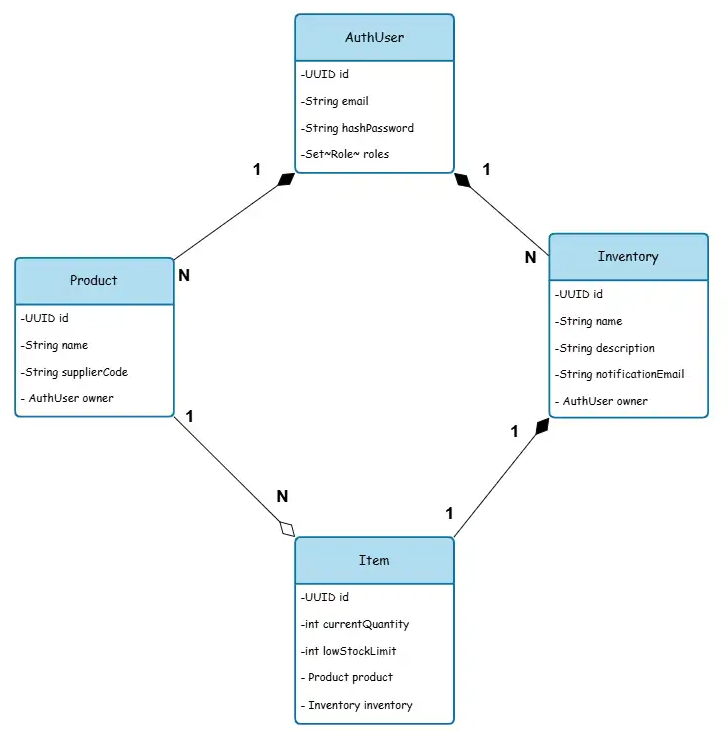

# Inventorize API 📦

## Sobre o Projeto 🚀
O Inventorize API é um projeto desenvolvido como parte da disciplina de Projeto de Bloco: Desenvolvimento Back-end 
2025.1. Esta API oferece uma solução simples para gerenciamento de inventário, e busca demonstrar a aplicação prática de 
conceitos modernos de desenvolvimento de software para a WEB.

## Tecnologias Utilizadas 🛠️
- **Spring Boot**: Framework principal para desenvolvimento da API REST.
- **Spring Data JPA**: Persistência de dados e mapeamento objeto-relacional.
- **Spring Validation**: Validação de dados.
- **SpringDoc OpenAPI**: Documentação automática da API.

## Banco de Dados 💾
O projeto implementa uma estratégia de banco de dados em memória para desenvolvimento e um banco de dados relacional 
para entrega final da disciplina.
- **H2 Database**: Banco de dados em memória para desenvolvimento.
- **PostgreSQL**: Banco de dados relacional para entrega final

## Documentação 📚
A documentação completa da API está disponível através do Swagger UI após a execução do projeto.

## Características ✨
- Arquitetura REST
- Documentação automática com OpenAPI
- Validação de dados

## Status do Projeto

### Diagrama de Classes 📊

---
Desenvolvido por Bruno Martins (@3runoAM) ☕